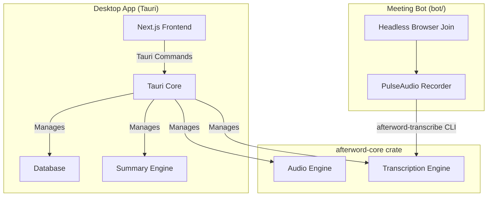

# System Architecture

Afterword's desktop app is a self-contained application built with [Tauri](https://tauri.app/). It combines a Rust-based core with a Next.js frontend into a single, efficient, and cross-platform application. A separate meeting-bot service shares the same Rust transcription pipeline instead of reimplementing it.

## High-Level Architecture Diagram

## Component Details

### Frontend (Next.js)

*   Provides the user interface for managing meetings, displaying transcriptions, and configuring the application.
*   Communicates with the Rust core through Tauri's command system.

### Backend (Rust Core)

*   **Tauri Core:** The heart of the desktop app, responsible for managing the window, handling events, and exposing the Rust core to the frontend.
*   **Audio Engine / Transcription Engine:** Live in `crates/afterword-core`, a Tauri-free crate. It captures audio from the microphone and system, processes it, and transcribes it with local speech-to-text models (Whisper or Parakeet), optionally GPU-accelerated. The desktop app's `app_lib` re-exports this crate rather than containing the code itself.
*   **Database:** A local SQLite database that stores meeting metadata, transcripts, and summaries.
*   **Summary Engine:** Generates meeting summaries using various Large Language Models (LLMs), including local models via Ollama.

### Meeting bot (`bot/`)

*   A separate Node/TypeScript service, not part of the desktop app, for
    meetings the user did not host locally. It joins a call in a headless
    browser (Google Meet only today), announces that it is recording, and
    captures audio through a PulseAudio null sink.
*   It transcribes the recording by shelling out to the `afterword-transcribe`
    CLI built from `crates/afterword-core`, so the desktop app and the bot
    produce transcripts in the identical `TranscriptSegment` shape.
*   Scope and what is not yet built (calendar trigger, Zoom/Teams, persistence,
    backend upload, legal review of consent) are tracked in
    [../ROADMAP.md](../ROADMAP.md), Phase 4, and in
    [../bot/README.md](../bot/README.md).
